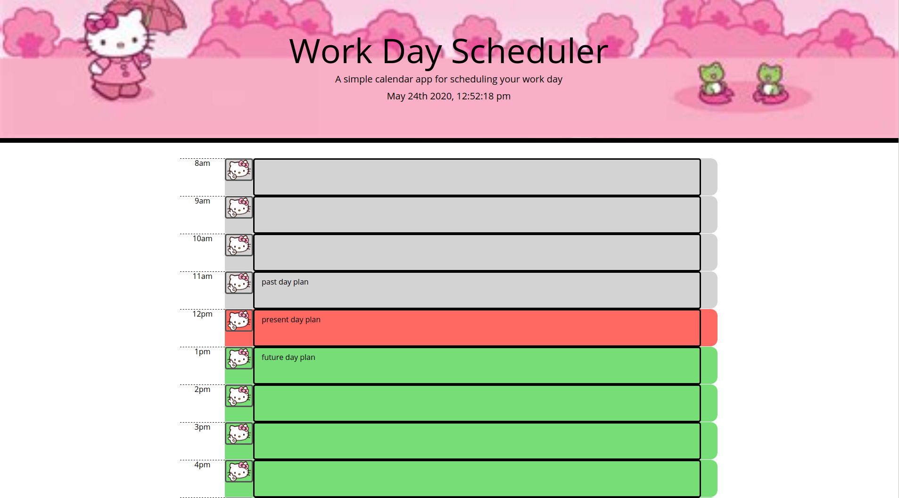

# homework-week-5
Work Day Scheduler

# 05 Third-Party APIs: Work Day Scheduler

In this assignment, I learned the hard way why we want the script to work before styling the application. 

The web application uses moment.js format wrapped in a function to display the time and date live in only 4 lines of code rather than the 22+ lines I was building on my own. Which makes adding time into a page cleaner and simpler than custom building the time yourself.
However, if you would like a more custom built time, I'm not opposed to the full live clock function build.
Currently, the application only displays a loose work day set of hours from 8am to 8pm. (In the next update, I would like to make this more custom to add or remove time blocks, move between calendar dates, or change the theme.)

The current time of day will be highlighted red.
Passed hours will be highlighted gray.
Future hours will be highlighted green.

Click on the time card you wish to store your day play and then click the save button on the left of the card near the time displayed.
You MUST use the designated save button for that time card in order for the contents of that card to be saved. (In a future update, I may include a "Save All" and "Clear All" button.)

The following image demonstrates the application functionality:

